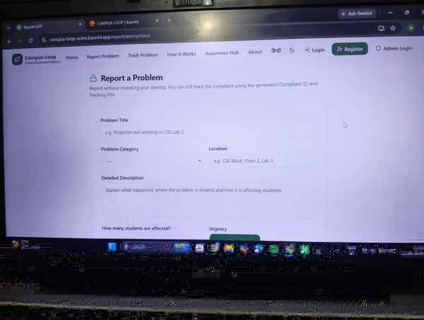
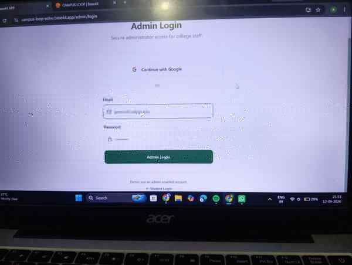
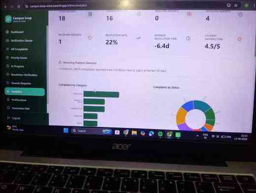

# CampusLoop – Campus Problem Reporting & Resolution System

CampusLoop is an SDG-focused web prototype for reporting campus problems, tracking their status, and collecting feedback after resolution.

**Live prototype:** https://campus-loop-solve.base44.app

## Workflow

**Report → Review → Action → Resolution → Feedback**

## Features

### Students
- Report problems with details and evidence
- Report anonymously when needed
- Track status and progress
- Give feedback after resolution

### Administrators
- Review and validate reports
- Update status and progress
- Monitor unresolved issues
- View analytics and notifications
- Close resolved complaints

## Prototype Screenshots

### Home Page

### Report Options

### Problem Report Form

### Admin Login

### Admin Dashboard

### Recent Reports

### Analytics

### Notifications

### Report-to-Resolution Workflow

## SDG Relevance

CampusLoop supports transparent and accountable campus management through student participation and trackable issue resolution.

## Future Scope

- AI-assisted complaint classification
- Duplicate detection and urgency scoring
- Escalation and automatic notifications
- Campus issue heatmaps and department analytics
- Multilingual and accessibility support
- Mobile application
- Independent backend and authentication

## Tech

Built with Base44. Application source code export is not included in this repository.
